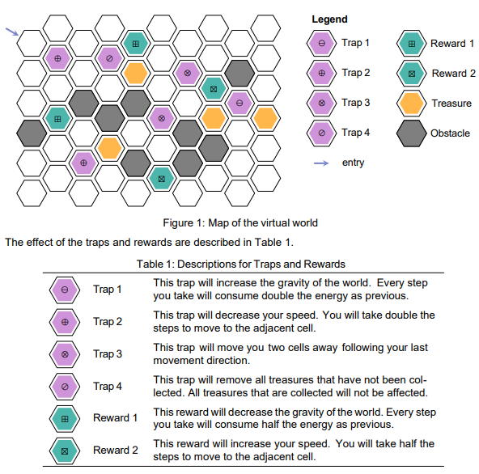

# A* Search Algorithm
This project is a solution to the maze problem provided below:

This solution uses the A* search algorithm to determine the best solution for the problem.

## Assumptions
•	The goal is achieved when all treasures are collected regardless of where the final node is

•	The cost of moving to any adjacent cell will always be the same unless affected by a trap or reward

•	The cost of moving to an adjacent cell will be 1 initially

•	The traps and rewards’ effect are activated immediately after stepping on it

•	Each trap or reward can only be activated once

•	Trap 3 will teleport the player 2 cells back along the path they took to get to the trap

•	Trap 3’s teleport effect will not incur any cost to the player

•	Trap 4 will always end in a game over state if there are still uncollected treasures

•	Trap 1, trap 2, reward 1, and reward 2’s effect cannot stack with the trap or reward of the same type

•	The effect of trap 1, trap 2, reward 1, and reward 2 can stack with each other 

•	Trap 1 and trap 2’s effect will have the same effect on cost in the code as they are fundamentally similar, this will be the same for reward 1 and reward 2

## Coordinate system
This program implements offset coordinate, specifically the "even-q" vertical layout, that has been defined by Red Blob Games (2013) in their blog post: https://www.redblobgames.com/grids/hexagons/, to implement the coordinate system.

## Heuristic function
The most important function for the A* search algorithm is the heuristic function. This function estimates the lowest remaining cost required to collect all remaining treasures. It is crucial for the heuristic to be admissible. For the heuristic function, itertools will be imported and used to obtain all permutations of the remaining goals. Then, for every permutation, the distance from the current coordinate to every uncollected treasure will be obtained using the getDistance function. The permutation that returns the shortest total distance will be used for the final heuristic calculation. Afterwards, the function will check if the coordinate is an event, if it is either trap 1, trap 2, reward 1, or reward 2, the function will adjust the heuristic calculation to simulate stepping into the event. This is done to ensure that the heuristic calculation stays as accurate as possible. If the coordinate triggers trap 4, an overly high value will be returned as the heuristic cost. This is done to discourage the algorithm from exploring it. This approach is taken as it is assumed that this trap will result in a game over state. If no event will be triggered, the function will return the shortest distance obtained earlier multiplied by the cost to travel.
